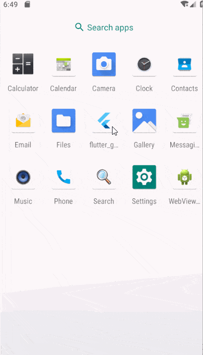

# flutter_gank
A  flutter client for [gank.io]( http://gank.io/) 

# ScreenShot
 

 

# pub
```yaml
dependencies:
  flutter:
    sdk: flutter
  dio: 2.1.3
  scoped_model: ^1.0.1
  fluttertoast: ^3.0.4
  # The following adds the Cupertino Icons font to your application.
  # Use with the CupertinoIcons class for iOS style icons.
  cupertino_icons: ^0.1.2
  cached_network_image: ^0.8.0
  shared_preferences: ^0.5.2
  flutter_webview_plugin: ^0.3.5
  photo_view: ^0.3.3
```